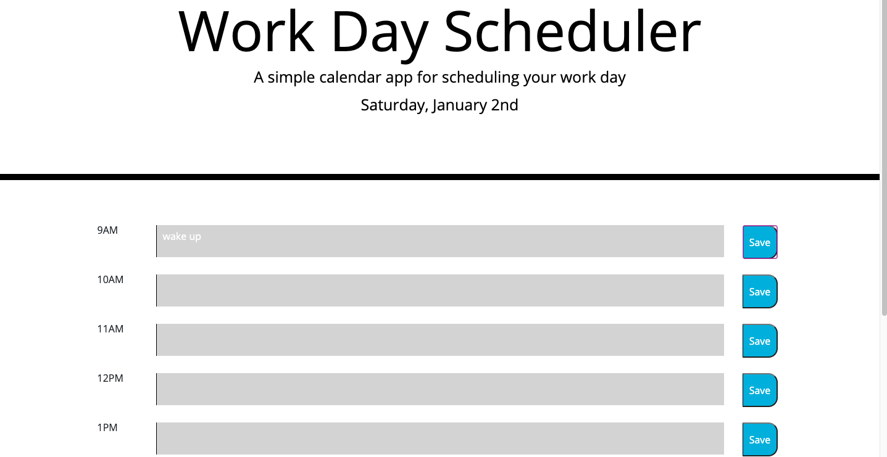

# Work-day-scheduler

In this assignment I created a work day schdeduler 9AM-5PM. In the time slots you can type what you will be doing in that hour and it will save in the local storage. 

In each time slot it is color coded meaning it will show past, present and future. For example, if its grey it would mean it past. The current hour it will show red and for the future it will turn green. 

Since it it currently almost 7pm: 

-- all the time slots are grey